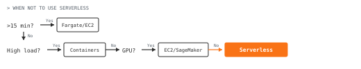
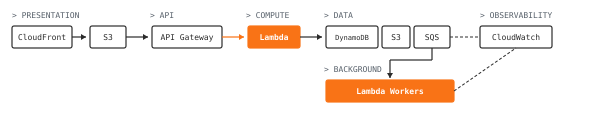
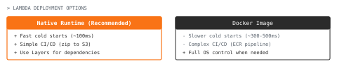
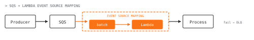
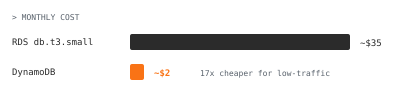
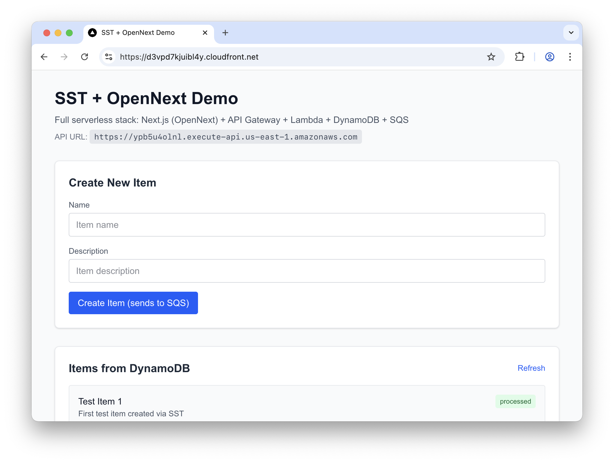
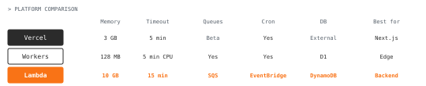
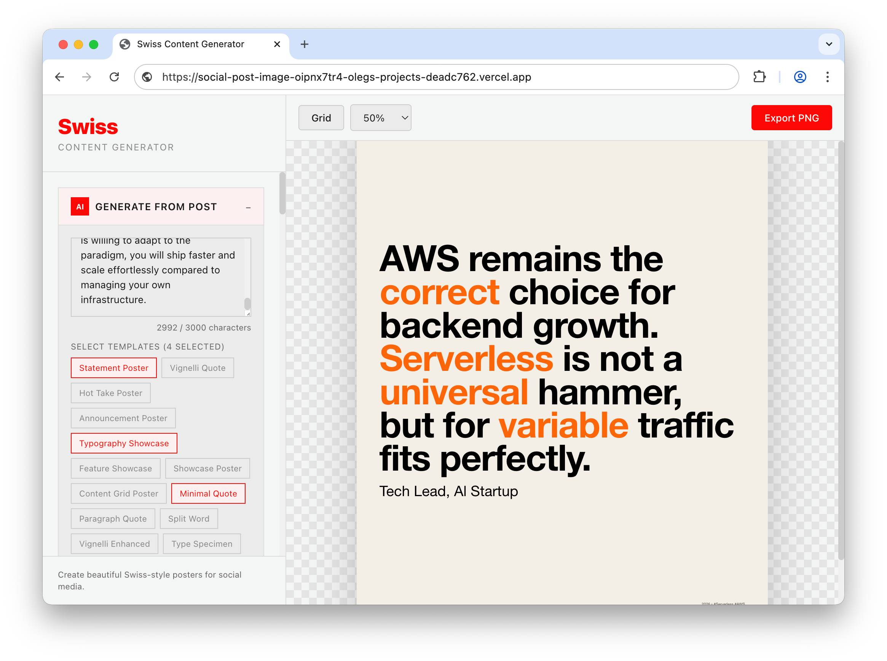
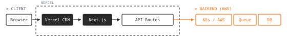
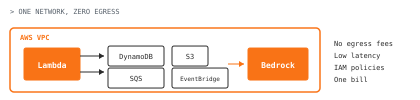

In the last 6 months, I've helped **3 AI startups migrate from Vercel or Cloudflare to AWS Lambda**. The pattern is the same: they start on a platform with great DX. Then the wall shows up: background jobs, retries, queues, cron, and eventually a "this endpoint needs 2-8 GB RAM for 4-10 minutes" workload — and they land on AWS.

To be fair: Vercel and Cloudflare captured developer attention for good reasons. Vercel ships Next.js fast — previews, simple deploys, great DX. Workers are great for edge use-cases: low latency, fast cold starts, global distribution. Both solve real problems.

Where things get harder is when the app grows a backend shape: queues, retries, scheduled jobs, heavier compute, private networking. Vercel still relies on third-party partners for queuing (like Upstash or Inngest), adoption involves piecing together vendors. Workers are fantastic for edge latency, but you feel constraints fast (memory limits, lack of native binary support, and file system restrictions), when Lambda is built for "bigger" invocations in mind (more memory and longer max runtime), with SQS, DynamoDB, and EventBridge under the same network.

For request-based apps calling LLMs, AWS Lambda tends to cover what startups actually need: compute, queues, persistence, scheduling in one network. **Pay-per-use, no infra to manage, often near $0** for small workloads. The tooling improved too — [SST](https://sst.dev/docs/) made deployment much easier. But the hype moved on before anyone noticed.

## The Hype Died, but did Serverless?

The biggest criticism of serverless technology, especially with AWS, is that setting up the infrastructure is complicated, starting from defining policies to actually creating all of the AWS resources and connecting them together. It has a learning curve and tools like [SAM](https://docs.aws.amazon.com/serverless-application-model/latest/developerguide/what-is-sam.html) simplify it, but they oftentimes are brittle or have bugs. SAM was a great start — it built the hype and community around serverless — but it wasn't as straightforward as modern development tools. Working at orgs where I had to introduce it to engineers used to Docker containers, Docker was a faster workflow than CloudFormation wrappers. **SST** fixed this, but by then developers had already moved to Vercel or Cloudflare.

Another big problem is **cold start** with the compute itself, the time that is required to spin up the compute resource and load the runtime and then execute the code. This means serverless shouldn't be viewed as a short-running server process, but rather as a different computing paradigm that requires factoring specifics of the underlying constraints.


[Spacelift](https://spacelift.io/blog/aws-lambda-migration), a CI/CD platform, went the other direction in 2024: ECS to Lambda for async jobs. Spiky traffic made always-on containers expensive.

## When NOT to use Serverless

Of course, serverless is not universal. Know when to reach for something else.

In 2025, [Unkey moved away from serverless](https://www.infoq.com/news/2025/12/unkey-serverless/) after performance struggles. Their pattern: high-volume workloads with tight coupling between components. As traffic grew, pay-per-invocation stopped making economic sense. This mirrors the [Prime Video case from 2023](https://www.infoq.com/news/2023/05/prime-ec2-ecs-saves-costs/) — both had architectures where serverless overhead exceeded the benefits. The lesson isn't that serverless failed; it's that **serverless has a sweet spot**, and high-throughput tightly-coupled systems aren't in it.

When to reach for something else:

1. **Long-running processes**. Applications like AI agent orchestrators would not work on Lambda due to hard 15-minute timeout. In this case, switch to [Fargate](https://docs.aws.amazon.com/AmazonECS/latest/developerguide/AWS_Fargate.html) or regular EC2 instance.
2. **Predictable high traffic or constant load**. You would gain more benefit from using containers in this case. Serverless is way better for bursty or unpredictable traffic.
3. **GPU workloads**. Lambda does not support GPUs: for machine learning inference that requires CUDA, you have to use either **EC2** or **SageMaker**.
4. **High-throughput media pipelines**. Orchestrating many state transitions per second through [Step Functions](https://docs.aws.amazon.com/step-functions/latest/dg/welcome.html) gets expensive fast. The Prime Video case is typical — they triggered a transition for **every single video chunk**, hitting massive limits and costs. Use containers for stream processing.
5. **Your team is already efficient elsewhere**. If you have existing infrastructure — Kubernetes, for example — and the team knows it well, don't force serverless. It takes time for an org to adopt an unfamiliar paradigm. For greenfield projects and validation, serverless is great. For teams already shipping on K8s, keep shipping.
6. **Legacy dependencies that need a full OS**. Some applications depend on libraries that are hard to package for Lambda. At times you just need a VM to run the thing. Serverless is problematic when you're fighting runtime constraints.
7. **Unsupported programming languages**. Don't experiment with languages Lambda doesn't officially support. Custom runtimes add overhead that's rarely worth it. Stick to Node.js, Python, Go, Java, .NET — the supported options.



For request-based apps with variable traffic, especially AI-integrated APIs, serverless fits well.

## The Stack

If you already have AWS basics, building serverless there makes sense. Here's the stack and how to use it effectively.



### Presentation Layer

For the presentation layer, use a CDN and object storage for static assets. That's typically **[CloudFront](https://docs.aws.amazon.com/AmazonCloudFront/latest/DeveloperGuide/Introduction.html) + [S3](https://docs.aws.amazon.com/AmazonS3/latest/userguide/Welcome.html)**, as you get benefits from the edge computing and the AWS infrastructure. S3 is useful because you can just build your HTML and CSS artifacts and upload them to the object storage. This decouples your frontend and web assets from your server, but brings architectural limitations: you can only do static exports. Fine for blogs, but you lose Server-Side Rendering (SSR) capabilities needed for dynamic SEO or personalized content.

When you have the CDN in place, it's worth thinking about how you would coordinate request execution. You can use an **Application Load Balancer** to forward requests to Lambda, but I'd recommend **[API Gateway](https://docs.aws.amazon.com/apigateway/latest/developerguide/welcome.html)** for most cases. It handles request routing, rate limiting, and authorization out of the box. Getting IAM permissions right is critical, but once configured, your requests flow directly to Lambda.

### Compute

The next component is your compute layer — where business logic lives. For serverless execution, use **[AWS Lambda](https://docs.aws.amazon.com/lambda/latest/dg/welcome.html)**. It runs your code without provisioning servers, with usage-based pricing: you pay per 100ms of execution. Lambda is designed for event-driven workloads and short-lived compute (up to 15 minutes); anything longer, reach for Fargate. For prototypes, web apps, and AI-integrated APIs, Lambda is a natural starting point — call LLMs, build UI wrappers, handle business logic, all without managing servers.

When deploying Lambda, you have two options: native runtime or custom Docker images. Native is recommended for faster cold starts. Cold starts are real, treat Lambda as an event-driven runtime, not a "tiny server". Keep the handler small with simple initialization, and be intentional about concurrency and the warmup when latency becomes a problem.



For complex configurations, use [Lambda Layers](https://docs.aws.amazon.com/lambda/latest/dg/chapter-layers.html) to package dependencies separately from your function code. Layers let you include binaries, libraries, or custom runtimes while keeping cold starts fast. Use Docker as a last resort, when you need full control over the OS environment or dependencies that won't fit in layers. The tradeoff: slower cold starts and CI/CD complexity. On GitHub Actions, you need a Docker build pipeline instead of just dropping code to S3 and calling the update API.

### Background processing

For async work, use **[SQS](https://docs.aws.amazon.com/AWSSimpleQueueService/latest/SQSDeveloperGuide/welcome.html)**. Lambda's event source integration handles batching, scaling, and polling for you.

Years back, I worked with an enterprise architect on a startup backend. He proposed SQS for our messaging layer. At the time, this seemed odd — SQS wasn't easy to run locally. You couldn't reproduce the infrastructure the way you could with RabbitMQ. But what I gained from that experience was understanding that sometimes you should explore managed services and accept the tradeoff: you lose local reproducibility, but you stop dealing with memory and compute constraints entirely.

To this day, if the messaging architecture is simple, I go with SQS and Lambda combined with event source mapping. You don't have to write the consumer yourself — the integration handles all of that. And that consumer code is often problematic to test anyway.



At a clickstream startup, we faced this exact pattern: process event data from high-traffic e-commerce sites, unknown traffic patterns, weeks to launch. Lambda workers pulled from SQS with event source batching, processing multiple events per invocation. CDK handled deployment. The system scaled on its own.

An EKS equivalent would have meant provisioning a cluster, configuring autoscaling, setting up observability, managing node health. We skipped all of that and shipped.

### Persistence

For persistence, use **[DynamoDB](https://docs.aws.amazon.com/amazondynamodb/latest/developerguide/Introduction.html)**, but don't treat it like a relational database. Its power comes from partition keys, sort keys, and secondary indexes, so invest time understanding the data model. Think of it as an advanced key-value store with sorting capability. Optimize your queries when you hit scale; for prototypes, just build. For deeper learning, Alex DeBrie's [DynamoDB Guide](https://www.dynamodbguide.com/) covers single-table design and access patterns.

At a B2B marketing startup I was working on, the main data tier was MongoDB collecting events from large e-commerce stores. But the application had also domain tables to store data related to dashboard: organizations, users, authentication, settings. Originally they lived on RDS, which was overkill. At the start there were 10-15 enterprise clients, and paying a dedicated RDS instance for that load made no sense.

**RDS Cost:** `~$35.00` / month for db.t3.small, **DynamoDB cost after migration:** `~$0.00 - $2.00` / month (mostly storage costs) for the same workload.



On launch we stored that data in DynamoDB, organizations, users, auth, settings had their own table. At a later point Dynamo was used for the more data-intensive part with session tracking (by using TTL indexes) and debugging logs. The pattern worked for low traffic tables because of zero maintenance and pay-per-request pricing.

### Observability

For observability, **[CloudWatch](https://docs.aws.amazon.com/AmazonCloudWatch/latest/monitoring/WhatIsCloudWatch.html)** shows your errors and aggregations. Metrics and alarms work out of the box, and logs appear automatically without configuration. Later you can instrument with OpenTelemetry or connect other services, but for a basic serverless application, CloudWatch is more than enough.

For years, I found CloudWatch UI and Insights sluggish compared to Grafana. But now I wire AWS SDK to Claude Code and let the AI pull logs and analyze issues. The stable CLI and REST API make log processing trivial.

## How to be successful with AWS serverless

Build applications without technology bias. A few years ago, Docker containers and microservice orchestration were popular, which created misconceptions about serverless. Aim for simplicity: reduce your problem to the simplest actions, refine your data model, and design your system as a transactional request-based application. That's what makes serverless work.

Start with an **Infrastructure as Code** tool like Terraform, AWS CDK, or the increasingly popular SST. You define how infrastructure gets created, then deploy that stack to your AWS account. I personally use Terraform because I want full control over my infrastructure. But for getting started quickly with pre-built blocks, SST is the better choice since productivity matters early on.

Previously, AWS was less approachable since deploying with CloudFormation or SAM was painful. CloudFormation itself is stable and battle-tested: CDK and SST (before v3) both sit on top of it, but the raw DX isn't great. That's why picking the right abstraction layer matters: you get CloudFormation's reliability without writing YAML by hand.

### Pick your IaC tool carefully

In 2026, Lambda deployment has vastly improved. For getting deep expertise in AWS, I'd recommend learning a few alternatives: start with CloudFormation and CDK to understand AWS-native infrastructure, then explore Terraform.

| Tool          | Advantages                                                            | Disadvantages                             |
| ------------- | --------------------------------------------------------------------- | ----------------------------------------- |
| **SST**       | Rethought DX for serverless, hot-reload, efficient resource usage     | New, smaller ecosystem                    |
| **Terraform** | Full control, predictable plan/apply, scales to EKS and complex infra | HCL learning curve                        |
| **CDK**       | Native TypeScript/Python, easy to code                                | CloudFormation underneath, can be brittle |


In the startup teams I've consulted, Terraform is typically the go-to infrastructure as code solution because of its architecture where you execute plan and apply changes. It's been reliable in practice.

For developer experience and prototyping, SST fits well. A few years ago, serverless meant wrestling CloudFormation stacks. SST changed that, so you can hot-reload Lambda functions and iterate fast without managing infrastructure YAML. For getting started, **SST is a solid default**.

Setting up Lambda + API Gateway + DynamoDB with [SST v3](https://sst.dev/docs/) is simple:

```typescript
/// <reference path="./.sst/platform/config.d.ts" />

export default $config({
  app(input) {
    return {
      name: "my-api",
      removal: input?.stage === "production" ? "retain" : "remove",
      home: "aws",
    };
  },
  async run() {
    const table = new sst.aws.Dynamo("table", {
      fields: { pk: "string", sk: "string" },
      primaryIndex: { hashKey: "pk", rangeKey: "sk" },
    });

    const api = new sst.aws.ApiGatewayV2("api");

    api.route("POST /", {
      handler: "functions/handler.main",
      link: [table],
    });

    return { url: api.url };
  },
});
```

With coding agents like [Claude Code](https://github.com/anthropics/claude-code) or [OpenCode](https://opencode.ai/), getting this stack running takes minutes. Point the tool at your project, describe what you need: "set up Next.js with Lambda, SQS, and API Gateway using SST", and it figures out the configuration, writes the infrastructure code, and deploys it for you. The entire setup is under 100 lines of code. The barrier to serverless dropped from "learn CloudFormation" to "describe what you want."



Cloudflare Workers is popular but still maturing for backend use cases. Lambda remains the more common choice for serverless backends.

What about Vercel? It provides Next.js with serverless functions, but you can't build background execution logic or advanced infrastructure like queue services. The serverless environment is limited to Node.js API routes. It's popular among beginners because React and Node.js are familiar, but you're locked into Vercel as a vendor. Enterprises and startups still use AWS, and even modern AI applications run on AWS Bedrock. As a full-stack developer, investing in AWS serverless gives you more flexibility and portability.

## Why not Vercel or Cloudflare?



### Vercel with Next.js

Vercel is a good service for having everything set up. You write code, push it to GitHub, and it gets configured and deployed without any effort. It supports previews and permissions, simple environment variable configuration, and your frontend available on a CDN — all without messing with infrastructure code. This is powerful for getting your software out, and that's why it got popular. Not only because they develop Next.js, but because Next.js integrates well with Vercel, and it’s frictionless.

Vercel works for prototypes and UI-driven apps. If you're in the React ecosystem, you can move fast. I've built several apps on Vercel, mostly AI-integrated tools that need a quick frontend. Last time I created a poster generator with custom typography — the app called an LLM to generate a JSON schema, then rendered the poster. Vercel handled that perfectly: simple UI, one API route, done.



In my consulting work, I've seen two patterns:

**Pattern 1: Vercel as frontend layer.** One social network startup runs their infrastructure on Kubernetes but still uses Vercel for the web app. Why? The implementation stays in sync with their React Native mobile app, and Vercel's API routes connect cleanly to their backend. They get the benefits of both: React ecosystem on the frontend, scalable backend on K8s.

**Pattern 2: Vercel + AI pipeline.** An AI startup I'm working with uses Next.js as the frontend layer connecting to their document processing pipeline. The LLM-driven backend handles research on internal documents; Next.js just renders results. You'll find tons of templates for this pattern.



Vercel's limitation is the backend. They [announced queues in 2025](https://vercel.com/changelog/vercel-queues-is-now-in-limited-beta), but it's still in limited beta. For background jobs today, you need external services like [Inngest](https://www.inngest.com/) or [QStash](https://upstash.com/docs/qstash/overall/getstarted). And you're locked into their platform; Fluid Compute is Vercel-proprietary.

**I've seen this limitation create absurd workarounds**. One project I consulted on — a news aggregator built on Netlify — needed scheduled background jobs. Their solution: GitHub Actions calling a Netlify serverless function on a cron. It had no retries, no timeouts, and when the function failed, nobody knew until users complained. We reworked it to AWS: EventBridge scheduled rule triggering a Lambda with built-in retries, CloudWatch alarms, and dead-letter queues. The hacky setup became infrastructure that worked.

For a frontend layer that connects to backend services, Vercel works. For a complete backend, you'll outgrow it.

If you want Next.js without vendor lock-in, look at [OpenNext](https://opennext.js.org/). It's an open-source adapter that deploys Next.js to AWS Lambda, and SST uses it under the hood. You get App Router, Server Components, ISR, image optimization — most Next.js features work. The deployment is one line: `new sst.aws.Nextjs("Web")`. NHS England, Udacity, and Gymshark run production workloads on it. The main gotcha is middleware: it runs on the server, not at the edge, so cached requests skip it. For most apps, that's fine. If you want Next.js but need AWS infrastructure underneath, **OpenNext** is the escape hatch.

### Cloudflare Workers

Cloudflare is good at edge computing with innovative technologies. Workers run in V8 isolates — a smart idea that gives you near-instant cold starts. They excel at CDN and DNS, and offer a compelling alternative to get started.

I use Cloudflare for CDN and frontend hosting. The UI is clean, the CLI is simple, and deployment is quick. For static sites and edge caching, it's easier than AWS CloudFront.

But Workers are a different runtime model — not full Node.js. That's a feature for edge latency (cold starts under 5ms), but a constraint if you expect full Node compatibility or heavier workloads: many npm packages don't work. The 128 MB memory per isolate and 5-minute CPU time limit (not wall clock) make sense for edge, but they're restrictive compared to Lambda's multi-GB memory options and 15-minute max runtime. I played with deploying WebAssembly apps in Rust and Go, and the developer experience wasn't there yet.

I wouldn't build a startup on Cloudflare Workers yet. For edge routing and authentication, it's fine. For a full backend, it falls behind AWS.

### Firebase

At one startup, we had the infrastructure partially on AWS — the AI agent running in the background, but the frontend was React with Firebase Functions calling Firestore. Firebase did a great job as a prototyping tool; we were able to build a complex frontend with the database initially. But the problems stacked up:

1. The data was fragmented, living outside AWS. Generally considered bad practice.
2. React calling Firestore directly created tight vendor lock-in with Firestore.
3. Google Cloud feels disjointed compared to Firebase — Firebase is its own island.

We spent two months migrating to AWS, using equivalent resources to keep networking and IAM policies consistent across the whole application.

The one exception: I typically choose Firebase for Google authentication. It's the easiest way to get Google auth working — pluggable, no client configuration needed. For that specific use case, Firebase is a solid default. Otherwise, I go straight to AWS.

### Why I default to AWS

For startups expecting growth, here's why AWS makes sense.



1. **Industry-proven.** Large companies run production workloads on Lambda. Capital One runs [tens of thousands of Lambda functions](https://aws.amazon.com/solutions/case-studies/capital-one-lambda-ecs-case-study/) after going all-in on serverless. Thomson Reuters processes [4,000 events per second](https://aws.amazon.com/lambda/resources/customer-case-studies/) for usage analytics on Lambda. The failure modes are well-documented; the solutions exist.

2. **Infrastructure flexibility.** You can optimize costs, swap components, migrate from Lambda to Fargate — all within one network. With Vercel plus external services, you're stitching together pieces that don't guarantee coherent infrastructure.

3. **One network space.** Your Lambda talks to DynamoDB talks to SQS without leaving AWS. No cross-provider latency, no credential juggling, no surprise egress fees.

4. **Low cost to start.** Some argue serverless is overkill — just rent a $5/month VPS. But a VPS costs money from day one, while Lambda's free tier includes [1 million requests and 400,000 GB-seconds per month](https://aws.amazon.com/lambda/pricing/) permanently, DynamoDB gives you 25 GB free, and API Gateway offers 1 million HTTP calls free for 12 months. For low-traffic projects you can run for near $0 — and for prototypes with variable traffic, serverless is often cheaper than fixed infrastructure.

5. **AI-ready.** AWS is investing heavily in AI, and [Bedrock](https://docs.aws.amazon.com/bedrock/latest/userguide/what-is-bedrock.html) gives you access to Anthropic models (Claude and others) within AWS networking, so your Lambda calls Claude without leaving the network. If you qualify as a startup, they offer generous credits for large inference workloads. For AI-integrated apps, the whole stack stays in one place.

Learn the alternatives. When you need to scale, start with AWS serverless.

## How to get started with it in 2026

Start by building a complete backend within serverless constraints. Design around cold start limitations and use SQS and [EventBridge](https://docs.aws.amazon.com/eventbridge/latest/userguide/eb-what-is.html) for background execution. This stack works well for AI apps that call LLM inference APIs — not for AI agents that need to run for hours, but for request-based AI features. Whether you're a beginner or an advanced full-stack developer, serverless is worth the investment. Understand the limitations first, build after. The serverless stack rewards this discipline.

One caveat: serverless requires your team to think differently. At an ad tech startup, I watched a team struggle with a Lambda-based bidding system. The architecture was designed serverless because of the maintenance overhead we'd avoid — in theory, it was much easier to add or change parts of the ad tech we were building. But the backend engineers came from Docker and long-running servers. They understood request-response, but the tooling around AWS serverless — CloudWatch, S3, the whole stack — felt alienating compared to containerized apps built on FastAPI or Django. That workflow just wasn't available for serverless. The deadline moved three months, which brought a lot of problems. We had to switch to an ECS cluster with containers, which was suboptimal for the bursty nature of ad bidding. The architecture wasn't wrong; the team-stack fit was. If your engineers aren't familiar with serverless, budget time for learning or pick what they know.

**Start with SST, hit your first bottleneck, then reevaluate.**

The serverless stack isn't going anywhere. **Master the constraints, and you'll ship faster than teams managing their own infrastructure.**

---

## References

- [AWS Lambda Pricing & Free Tier](https://aws.amazon.com/lambda/pricing/) — Detailed pricing information including the generous free tier (1M requests/month permanently).
- [DynamoDB Guide - Alex DeBrie](https://www.dynamodbguide.com/) — The definitive resource for DynamoDB data modeling, covering single-table design and access patterns.
- [SST Documentation](https://sst.dev/docs/) — Official docs for SST v3, the modern serverless framework with hot-reload and TypeScript support.
- [OpenNext](https://opennext.js.org/) — Open-source adapter for deploying Next.js to AWS Lambda without vendor lock-in.
- [Spacelift: AWS Lambda Migration (2024)](https://spacelift.io/blog/aws-lambda-migration) — Case study of migrating from ECS to Lambda for async workloads with spiky traffic.
- [Unkey: Moving Away from Serverless (2025)](https://www.infoq.com/news/2025/12/unkey-serverless/) — Counter-example showing when high-volume tightly-coupled systems outgrow serverless.
- [Prime Video Serverless to Monolith (2023)](https://www.infoq.com/news/2023/05/prime-ec2-ecs-saves-costs/) — The infamous case where Step Functions costs drove a move to ECS for video analysis.
- [OpenCode](https://opencode.ai/) — Open-source AI coding agent by SST, provider-agnostic and privacy-focused.
- [Inngest](https://www.inngest.com/) — Durable workflow engine for background jobs, often used with Vercel.
- [QStash](https://upstash.com/docs/qstash/overall/getstarted) — Serverless message queue from Upstash, an alternative for Vercel deployments.

