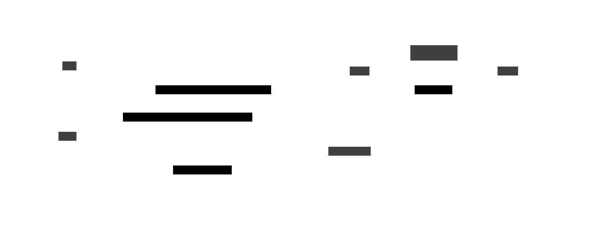
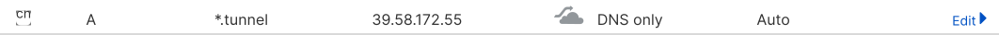

> TL;DR: I built a lightweight, self-hosted HTTP tunnel that turns `localhost` into a public **HTTPS** URL. No paid plans, no secret black boxes. Just one Go binary, Caddy with wildcard TLS, and a $0/month Oracle Cloud VM. [GitHub repo](https://github.com/nexo-tech/microtunnel)

## Why I Built It

My development workflow lives mostly on a free Oracle Cloud VM: SSH, Neovim, tmux—the usual hacker starter pack. I tried many ways to easily expose my local apps for testing webhooks, sharing demos, and collaborating with friends.

- **Ngrok**? Free plan naps after 2 hours. Paid plans needed for reserved domains and longer sessions.
- **Cloudflare Tunnel**? Closed source, and a bit heavier to set up (Cloudflare account, Zero Trust dashboard, connector configs).
- **Self-hosting other tunnels**? Often complex, heavyweight, or missing automatic HTTPS.

I wanted **full control**, **zero vendor lock-in**, and **wildcard HTTPS certificates** — without paying or managing unnecessary infrastructure.

Thus: a 300-line Go server, a single WebSocket multiplexed with [yamux](https://github.com/hashicorp/yamux), and Caddy configured with Cloudflare DNS for automatic wildcard TLS.

The result is a frictionless tunnel that costs $0/month, survives webhook storms, and gives you your own little "ngrok clone": fully owned, with no session timeouts or vendor dependencies.

## Architecture Overview



- **Client** connects to `/tunnel` endpoint on the VM.
- Receives a **random 8-character subdomain** (e.g., `ab12cd34.tunnel.example.com`).
- **Each HTTP request** from browsers becomes a **new yamux stream**.
- Streams proxy through WebSocket to `localhost` on your local machine.
- **Caddy** handles HTTPS with wildcard certificates issued in seconds.

## How It Works

- **WebSocket** keeps the session alive and multiplexes requests using **yamux**.
- **Wildcard TLS** certificates are issued via Cloudflare DNS-01 challenge; every subdomain instantly green-locked.
- **Hijack** incoming HTTP connections to stream them directly without re-encoding.
- **Single binary** Go server and client; easy to compile and deploy.

WebSocket tunneling avoids the need for raw TCP passthrough, surviving corporate firewalls and Wi-Fi restrictions.

## Setup Guide

### Prerequisites

You will need:

- a domain name (`example.com`)
- VM — could be a free-tier VM such as AWS Free Tier, Azure, Oracle Free Tier, or similar.
- go (to build the app)

### Server and application setup

You’ll need to set up a VM. Here’s how you could set up a [free Oracle VM](https://nexo.sh/posts/setup-oracle-vm/), as I did to have more resources to play with. Alternatively, you can run a free-tier EC2 instance from Amazon, or an equivalent VM on another cloud provider.

The next step is to build the binary for both the client and server by running:

```sh
make build
```

This will compile `microtunnel` binary in the same folder. For running server application, you need to specify `port` and `base-domain-name` arguments:

```sh
./microtunnel --port 8080 --base-domain-name tunnel.example.com
```

### Configuring domain and caddy

We’ll be using Cloudflare for DNS management because of its API flexibility. You need to set up a wildcard A record pointing to your VM.



I used a \*.tunnel subdomain that points to the VM (39.58.172.55 in this case).

The next step is generating an API key on Cloudflare that allows creating SSL certificates for the wildcard DNS record. Go to profile (top right menu) -> API Token. Create token with the following permissions:

- Zone.Zone (Read)
- Zone.DNS (Edit)

Create a Caddyfile (or use the one from the repository):

```Caddyfile
*.{$DOMAIN}, {$TUNNEL_SERVER_DOMAIN_NAME} {
	tls {
		dns cloudflare {env.CF_API_TOKEN}
	}
	reverse_proxy localhost:3000
}
```

I used environment variables to pass the Cloudflare token (CF_API_TOKEN) and domain values. Since Caddy's default build doesn't include Cloudflare DNS support, we'll need to build a custom Caddy binary with the DNS plugin via `xcaddy`. Once xcaddy is installed, run make build/caddy to set up the app.

After that you can run Caddy and start testing:

```sh
sudo -E ./caddy run --config ./Caddyfile
```

### Connecting to server

Now, start your localhost app (e.g. Django) on port 8080, then initiate the tunnel connection:

```sh
./microtunnel --server-url wss://example.com/tunnel --port 8080
```

After a successful connection, you should see the domain name returned. Open the URL in your browser to access your local app from the public internet

## Engineering Highlights

| Component        | Purpose                                                                              |
| :--------------- | :----------------------------------------------------------------------------------- |
| **yamux**        | Multiplex HTTP streams over a single TCP/WebSocket connection.                       |
| **WebSocket**    | Works seamlessly through proxies and NAT; fewer moving parts than raw TCP tunneling. |
| **Wildcard TLS** | Fast and automatic SSL certs for all subdomains; no manual renewal.                  |
| **HTTP Hijack**  | Directly stream request/response bytes without re-encoding at the HTTP layer.        |

### Making Yamux Work with WebSockets

Early on, I started by trying to parse HTTP requests manually, send them over WebSockets, and reconstruct them on the other side. But that turned out to be too high-level: it introduced a lot of complexity around handling HTTP-specific edge cases like chunked encoding, connection reuse, and error propagation.

Instead, I shifted to a lower-level approach: using HTTP hijacking to capture the raw TCP connection, then multiplexing everything with yamux over a single WebSocket. This ended up being far simpler and more robust.

To bridge the gap between yamux (which expects a `net.Conn`) and WebSockets (which operate on framed messages), I wrote a small adapter that wraps a WebSocket connection and implements the `net.Conn` interface.

Key points in the adapter:

- **Read:** Accumulate full WebSocket frames into a buffer, then expose them as a regular Read() stream.
- **Write:** Send byte slices as binary WebSocket messages.
- **Deadlines:** Map SetReadDeadline and SetWriteDeadline directly to the WebSocket’s built-in deadline methods.

This design lets yamux multiplex multiple HTTP requests transparently inside a single WebSocket tunnel, without needing to reimplement or special-case HTTP logic.

At this scale and level of abstraction, most edge cases (like frame buffering or backpressure) are naturally handled by the underlying WebSocket and TCP stacks, so no special tuning was necessary.

## Security Notes

- Run Caddy with basic auth if the tunnel should not be publicly accessible.
- Use scoped Cloudflare tokens limited to DNS editing.

## What's Next

- Simple authentication support (e.g., token-based handshakes).
- gRPC transport mode (early experiments).
- Prometheus metrics for tunnel traffic.

## Where to Find It

- Code: [GitHub →](https://github.com/nexo-tech/microtunnel) (MIT license)
- Instant install: `go install github.com/nexo-tech/microtunnel/cmd/...@latest`

If this saves you a billable hour or two, I'd appreciate a ⭐.

Cheers!
