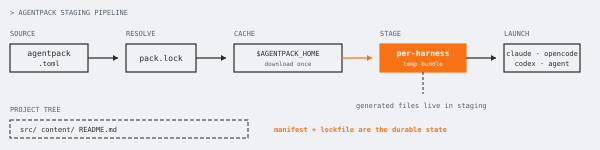
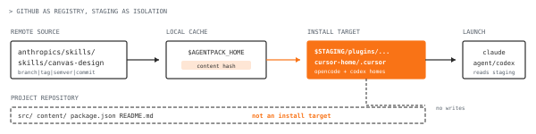
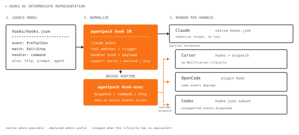

> Modern agents like Claude Code, Codex, Cursor and OpenCode need skills, hooks and MCPs, but they load them differently. I made a tool that creates an ephemeral staging configuration that loads into coding agents without polluting the global user or project configuration. [GitHub Link](https://github.com/OlegHQ/agentpack)



I've been using AI agents for building commercial software—it’s incredibly useful for creating quick prototypes and iterating on products for early-stage startups. Data analysis, triaging production issues, even undoing decisions that previously would take tremendous effort—like changing the programming language your project is written in—became essentially cheap. Before, writing CLIs/scripts custom to your needs required days of work; now they can be built in minutes, and that allows you to focus on problems that are meaningful to you.

## The harness is the new bottleneck

Of course, autonomous coding workflows are still a long way from being perfect. These systems cannot reliably produce high-quality code—even frontier models fail at making custom abstractions and generating maintainable code unless you prompt them correctly. What makes the situation worse is that **there's no single tool that is excellent at every software engineering problem**; instead we have a number of competing agent harnesses that implement essentially the same agent loop: Claude Code, OpenCode, Codex, Copilot, Cursor, etc., where you often find yourself restricted to a set of specific models and lacking the features to configure the agent flexibly. On top of that, **those CLI agents manage context differently, which often results in different coding performance for the same models**. Configuration is only partially standardized: many harnesses adopted [`AGENTS.md`](https://agents.md) — initially created by OpenAI and supported by Codex, OpenCode, Cursor and others. Skills have more or less landed on the [`SKILL.md` convention](https://agentskills.io/home), but it is far from being a standard. Hooks, custom rules and plugins haven't yet converged in the same way. [Claude Code](https://code.claude.com/docs/en/plugins) and [Cursor](https://cursor.com/docs/plugins) also have plugin systems, but they are not fully interchangeable. [MCPs](https://www.anthropic.com/news/model-context-protocol) became a widely adopted standard; however, the project-specific configuration file for MCPs still differs for every CLI tool. When working with teams on startups, **I often see a repository fully optimized for Claude Code, while using it with Codex requires hacking with symlinks or committing my own harness-specific configs to the team’s repository**.

### Every agent needs its own configuration

To this day, I’m using Claude Code as my daily driver. I know the flaws of the Opus model—it makes average code, may miss important things, gaslights itself, and ultimately makes wrong decisions, which makes it infeasible to run on autopilot. Nevertheless, it’s a good enough model for me. For speed, I use Cursor Agent with the Composer model through the `agent` CLI. It gets the job done for quick refactors, solving merge conflicts, and other light work. At the same time, I would never trust even the latest Composer to build anything serious; it’s simply not there. Anything complex I throw at Codex (GPT 5.5) with Playwright MCP connected, and with computer-use improvements it can reproduce almost any front-end issue and fix it. Gemini 3.5 Flash recently arrived with the Antigravity CLI; the harness is very rough and lacking, but the model seems very smart on a small set of non-trivial issues. So I end up with the problem of **having 3-4 CLI agents working on the same codebase, and I would like to share a set of skills and slash commands across all of them**. 

Harnesses like Claude Code have their own [plugin marketplace](https://code.claude.com/docs/en/plugin-marketplaces) with toggleable plugins. This is useful for discovering packages containing skills, agents, MCP or LSP servers and can be installed via the `/plugin` command, but those are specific to Claude and aren't a great fit for declarative or immutable environments like Nix Home-Manager, where **mutating config under `~/.claude` conflicts with a model of a reproducible, read-only home directory**. In such cases having an ephemeral staging layer for configuring AI agents makes more sense.

## agentpack: an ephemeral configuration layer for agents

Before agentpack, repositories I worked in ended up with something like this:

- `.claude/commands`
- `.claude/skills`
- `.cursor/rules`
- `.cursor/agents`
- `.opencode/commands`
- `.agents/skills`
- copied MCP config snippets
- symlinks I forgot to remove later

That works for a personal project, but **doesn't scale with a larger team where everyone may have their own preferences in AI tools**. The repository accumulates skills and other artifacts that automatically end up loaded into the context. On one full-stack monorepo I worked on, we had a heavily guardrailed agentic harness that on every request triggered a very token-hungry validation pipeline, especially with a replaced planning skill. The setup contained 50+ custom skills that had to be turned off manually, one by one, in Claude Code: those overrides were of course specific to the currently loaded project directory. One of the motivations for building agentpack was to **manage various complex agent workflows in an isolated way**. With agentpack, **the source of truth becomes a single manifest file**:

```toml
name = "my-project"
version = "0.1.0"

[dependencies]
"github.com/anthropics/skills/skills/canvas-design" = { branch = "main" }
"github.com/my-org/agent-configs/skills/incident-triage" = { tag = "v0.3.1" }

[modes.default]
base = "all"

[modes.frontend]
base = "all"
disable = ["package-path:github.com/my-org/agent-configs/skills/db-migration"]

[modes.incident]
base = "all"
disable = ["mcp:figma"]
```

In my consulting work, of course, I don’t want to commit obscure manifest files of some unknown tool to teams’ repositories, so I create a parent `<project-name>-workspace/<project-repo>` directory structure, where I init the `agentpack` config in the workspace directory. Running `agentpack sync` will reload all the dependencies and fetch the necessary repositories from GitHub. **Fetched repositories are cached in the user-wide home directory** and pulled from there on repeated reads of `owner/repo/path/commit` to eliminate the need to fetch the same repository multiple times.

### Existing alternatives

There are already tools that are trying to solve the problem of package management for agents. [AGPM](https://github.com/aig787/agpm) for example is using manifest and lockfile to install the agent configuration. [Microsoft APM](https://microsoft.github.io/apm/) focuses on reproducibility and being able to compile the same configuration to formats of different agent harnesses. Tools like [ruler](https://github.com/intellectronica/ruler) and [rulesync](https://github.com/dyoshikawa/rulesync) are based on keeping the same set of rules and configurations in sync across multiple agent tools. 

This is useful, but **most tools end up writing generated files into the project directory or user's home directory, which is something I wanted to avoid**. So agentpack not only downloads and generates skills, MCP configs and ports them over to the needed format, it also **stages those files in a temporary location and launches the agent against that generated configuration directory**. **The project repository stays clean**, while the agent is preconfigured with the needed set of skills, MCPs, hooks, agents and rules. Here's a brief comparison table:

| Tool | Main idea | Where generated files usually go |
|---|---|---|
| agentpack | Manifest + lockfile + modes | Temporary staging directory |
| AGPM | Git-based agent packages | Per-project folders (.claude, .opencode, .agpm) |
| Microsoft APM | Reproducible agent packages | Native harness folders + `apm_modules/` cache |
| ruler | Generate rules for many agents | Project files |
| rulesync | Sync rules/config across agents | Project or home config |

The way `agentpack` works is shown on the following diagram: 

<figure>
  
  <figcaption>The only state I want to keep is the manifest and lockfile; the harness-specific files should be cheap to throw away and regenerate.</figcaption>
</figure>


### Using GitHub as the registry

**Git as a package source is not a new concept**. This idea already became familiar with [Go](https://go.dev/ref/mod): a module can be downloaded from a version-controlled repository. AGPM and APM use Git as a source. In agentpack, **packages are resolved either from local references or from GitHub**. In the case of GitHub, **commits are pinned in `pack.lock`**, repositories are cached locally, and then a staged directory renders the necessary files from the downloaded packages. 

While I'm aware of GitHub's frequent uptime problems lately and realize that having it as a hard dependency as a tradeoff is real, I still find loading those skill files from GitHub simple and easy (similar to how we add packages in Go).

Other times, I would rather not bother checking the README.md and instead just navigate a directory of skills. So you can simply copy a GitHub URL pointing to a skill and the CLI will load it properly into the staging directory:

```bash
agentpack add https://github.com/anthropics/skills/tree/main/skills/canvas-design
agentpack sync
```

<figure>
  
  <figcaption>The important distinction is the install target: GitHub is only the source, while `$STAGING` is what the agent CLI reads.</figcaption>
</figure>

When packages are downloaded from remote sources it's required to trust those sources, just like running `npm install` or executing bash script downloaded via `curl`. To mitigate supply chain attacks the exact versions are pinned to the latest commits when the package was added in the `pack.lock`. You should still review what gets pulled into your staging environment.

### Design constraints

A design decision that was critical for me: **portability and reusability of configuration**. The `agentpack` idea is to **never copy assets to the project directory or the global user configuration** in folders like `~/.cursor` or `~/.claude`. 

The solution was to **create an ephemeral staging directory and pass it to the launch arguments of the agentic harness**, or use environment variables to do so. Practically speaking, this becomes a compat layer per tool:

- Claude Code is the simplest to support as it allows [`--plugin-dir`](https://code.claude.com/docs/en/plugins) argument for loading the staged directory.
- Codex supports [`CODEX_HOME`](https://developers.openai.com/codex/guides/agents-md) environment variable for setting an alternative configuration directory.
- OpenCode similarly to Codex supports [`OPENCODE_CONFIG_DIR`](https://opencode.ai/docs/config/) and `OPENCODE_CONFIG` variables.
- Cursor Agent requires changing the `$HOME` variable for cleanly passing the staging directory, but that introduces various additional complexities. 

With adding more tools it becomes even more challenging to support. I typically use agents to reverse engineer bundled JavaScript code or write smoke tests to understand how to get around the limitations of certain harnesses. E.g. rules in `.mdc` format are only supported by Cursor, so I had to generate a fallback skill that would load into harnesses like Codex or Claude Code. The Cursor CLI has undocumented bugs that were only possible to find by reversing what it is doing: for some reason, it only loads sub-agents from the project-local `.cursor/agents` directory and ignores the global `$HOME/.cursor/agents` dir (which may already be fixed, hopefully). So in the current state of things, I’ve made the best possible approximation of the ideal “package manager” for agent CLIs, with the hope that things will either get standardized or at least that the major CLIs will agree on additive loading of extra configs. 

### Modes: switching the agent’s working context

Having a fully dynamic configurator allows me to **define modes** (a list of toggles for whether certain skills are available in a given mode). In a full-stack Python & React.js monorepo, I want to **toggle Python-specific skills off for a front-end-heavy refactoring job** and maybe add additional granular frontend-specific rules and guidance for that. With a dedicated TUI and pre-configured modes in the `agentpack.toml` manifest, it becomes easy to do.

Mode is defined as three fields: a `base` (`all` means we have all plugins and skills toggled on, `none` is the opposite), `enable` and `disable` lists.

```toml
[modes.frontend]
base = "all"
disable = ["package:github.com/my-org/agent-configs"]              # drop the whole pack...
enable  = ["package-path:github.com/my-org/agent-configs:skills/tailwind.md"]  # ...except this one file
```

List values are defined as specific selectors with the following prefixes `package:` (whole package), `package-path:` (used when we need to have only a specific skill, MCP or agent from that package), `mcp:` (for toggling a specific MCP server). Then there's conflict resolution: when both the enable and disable values contain references to the same package, we prioritize the more specialized rule (similar to how CSS cascading works). In the example above the `tailwind.md` rule will get prioritized, as it is a more specialized skill, and it will be available in the harness as a result.

To keep things easy to configure, I created a simple TUI, where modes can be defined interactively. All the changes are written to the `agentpack.toml` after saving.


### Hooks as an intermediate representation

#### Claude Code’s hooks.json as the canonical hook model

<figure>
  
</figure>

For hooks emulation, I chose to **base the configuration on [Claude Code’s hook model](https://code.claude.com/docs/en/hooks)**: lifecycle events (PreToolUse, PostToolUse, UserPromptSubmit, Stop, etc.) and tool matchers such as `Edit` and `Grep`. Other CLIs support fewer events and handler types. 

Hook definitions are processed through four stages:

1. **Collect**. agentpack finds and collects all `hooks.json` files from four layers: the user-wide `~/.<harness>/hooks.json`, a plugin folder's `hooks.json`, hooks specific to a `SKILL.md` folder, and the project-specific `.agents/hooks/hooks.json`. All of them are parsed into a normalized form and merged with a stable sort. 
2. **Intermediate representation**. The merged hook definitions are normalized into a typed model that has a lifecycle event (`PreToolUse`, `PostToolUse`, ...), an optional tool-name matcher (e.g. `Edit`, which fires only for the edit tool), and a handler (`Command`, `Http`, `Prompt`, `Agent`).
3. **Rendering per target**. At this stage a harness-specific hooks configuration file is generated. For unsupported events we find the closest matching event (e.g. `PermissionsRequest` is modeled as `PreToolUse` in Cursor). `Http` or `Agent` handlers are replaced with the `agentpack hook-exec` command for CLIs that support only command execution.
4. **The runtime shim**. For any emulated event, `agentpack hook-exec` is called. It reads args from stdin, finds the real handler, and forwards the result.

This setup saves time writing hook configs for each new CLI; it tries its best to execute the config for any supported harness. For example, if you have custom search or retrieval tools and you want to force the agent to use them instead of the default `Grep` or `Read`, agentpack will try its best to make it work for every supported harness. 

### Compatibility matrix

As of June 2026, I created the following compatibility matrix. **Harnesses like Codex, OpenCode, and Claude Code were the most important to me, so I focused more on them.** 

| Capability | Claude | Cursor | OpenCode | Codex | Notes |
|---|---|---|---|---|---|
| Launch | `--plugin-dir` | fake `HOME` | `OPENCODE_CONFIG_DIR` | `CODEX_HOME` | Staging stays outside the repo. |
| Commands | Native | Native-ish | Native | Skill fallback | Codex disables model invocation for command skills. |
| Agents | Native | Native | Native | Skill fallback | Cursor needs a workspace overlay for CLI discovery. |
| Skills | Native | Native | Native | Native | Support files are copied where supported. |
| Rules | Skill fallback | `.mdc` | Skill fallback | Skill fallback | Cursor keeps `alwaysApply` and globs. |
| MCP | `.mcp.json` | `mcp.json` | `opencode.json` | `config.toml` | Merge order: plugins, manifest, `.agents`. |
| Hooks | Native | Partial | Partial | Partial | Missing lifecycles use `hook-exec` or diagnostics. |
| Modes | Yes | Yes | Yes | Yes | Filters packages, `.agents`, and MCP servers. |
| Maturity | Primary | Supported | Supported | Supported | Codex uses more fallbacks. |

Additionally to the main CLIs, I added experimental support for Grok and Antigravity CLIs, but due to their limitations I wasn't able to wire the hooks compatibility support. 

### Try it

```bash
agentpack init                      # stub agentpack.toml + v2 pack.lock
agentpack add github.com/anthropics/skills/skills/canvas-design
agentpack claude 
```

`agentpack` is a tool that grew from initially pre-defined nix home-manager configuration where I had custom aliases for Claude that included skills specific to different tech stacks by injecting a custom config through `--plugin-dir` argument. I rely on it every day while working with three or four agent CLIs at the same time. **It's the only package manager that stays out of my way, and it can pre-configure agents through *context-aware* modes.** If you happen to work on different projects and use multiple coding CLIs, **I think it will save you from the same mess it saved me from**. Contributions, issues, and ideas are welcome on [GitHub](https://github.com/OlegHQ/agentpack).

## References

- [agentpack](https://github.com/OlegHQ/agentpack) — the tool described in this post
- [AGPM](https://github.com/aig787/agpm) — git-based agent package manager
- [Microsoft APM](https://microsoft.github.io/apm/) — reproducible agent packages 
- [ruler](https://github.com/intellectronica/ruler) — apply one set of rules to many coding agents
- [rulesync](https://github.com/dyoshikawa/rulesync) — generate/sync rules and config across AI tools
- [AGENTS.md](https://agents.md) — cross-tool instruction file standard
- [SKILL.md convention](https://agentskills.io/home) — emerging skills format
- [Model Context Protocol (MCP)](https://www.anthropic.com/news/model-context-protocol) — Anthropic's announcement
- [Go modules](https://go.dev/ref/mod) — git-as-package-source precedent
- [Claude Code plugins](https://code.claude.com/docs/en/plugins), [hooks](https://code.claude.com/docs/en/hooks), and [plugin marketplaces](https://code.claude.com/docs/en/plugin-marketplaces) — Claude Code configuration docs
- [Codex configuration](https://developers.openai.com/codex/local-config/) — `CODEX_HOME`
- [OpenCode config](https://opencode.ai/docs/config/) — `OPENCODE_CONFIG_DIR`
- [Cursor rules](https://cursor.com/docs/context/rules) — `.mdc`, `alwaysApply`, globs

