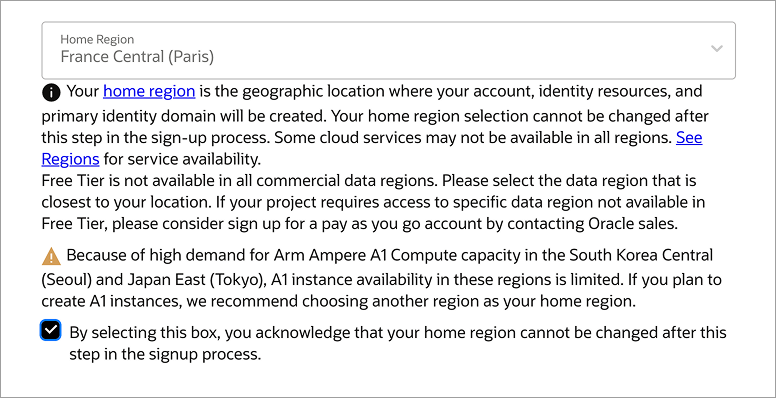
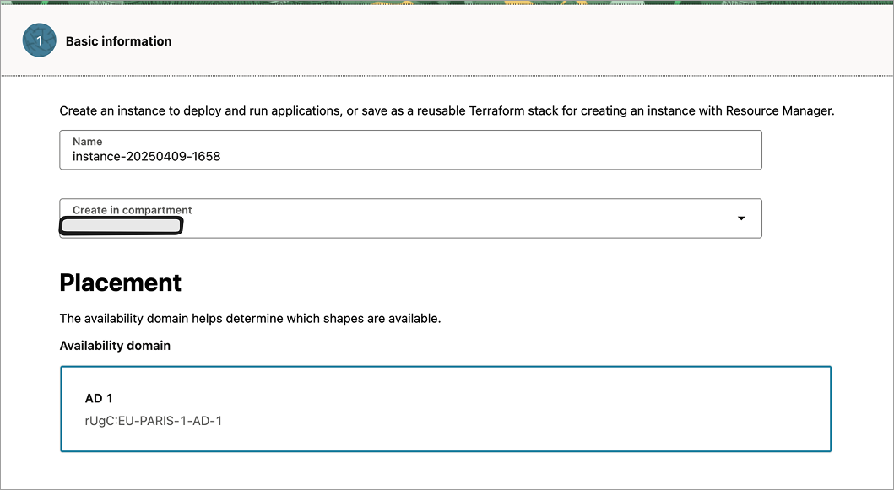
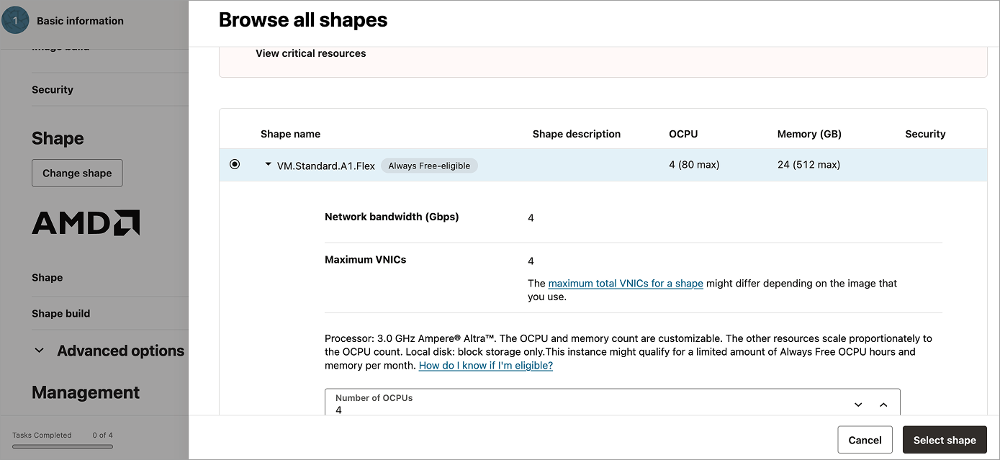
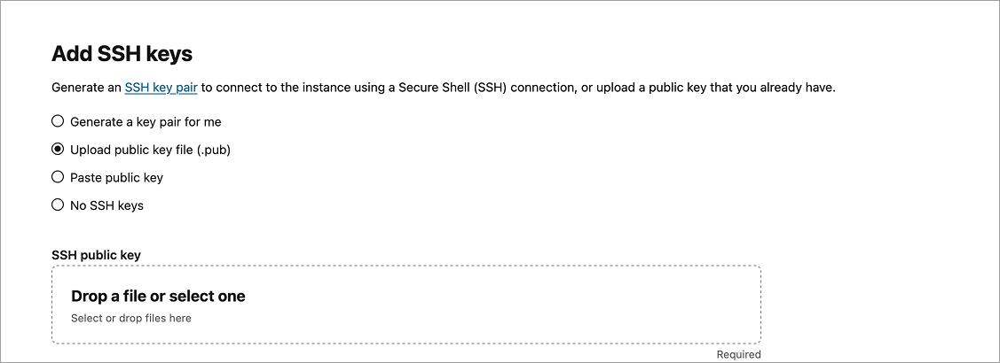
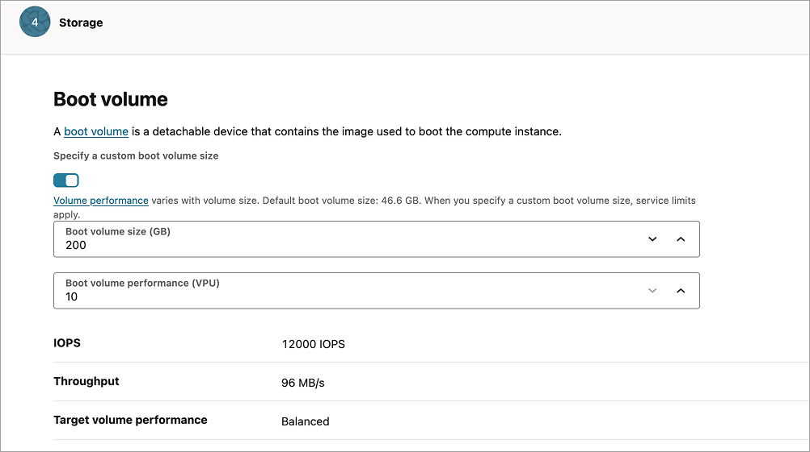
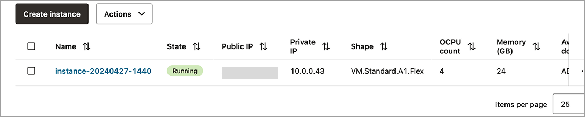
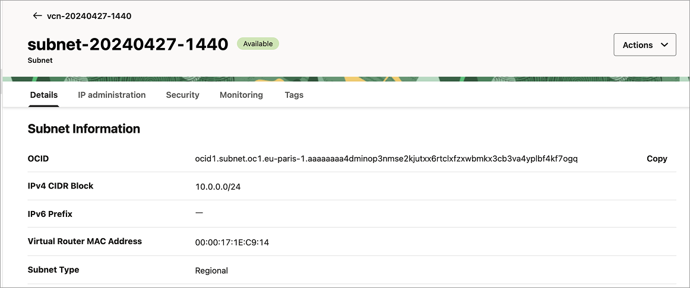
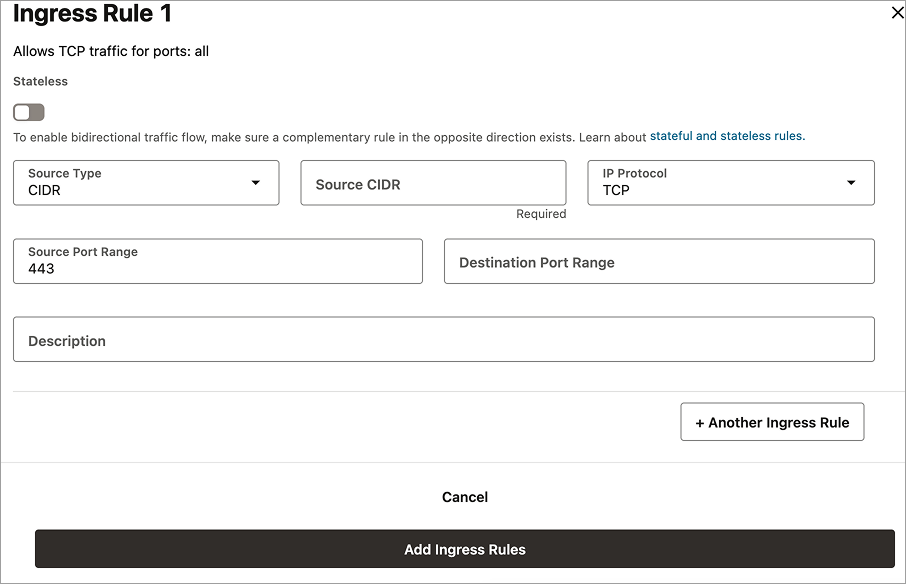

As a web developer, having access to a persistent, virtual machine in the cloud is often useful for testing and development. While many cloud-based providers offer limited free tiers (e.g. AWS, GCP, or Azure), Oracle Cloud stands out by providing a true "always free" cloud VM.

In this article, we'll look into setting up Oracle VM (under their always free tier). There are multiple advantages to using it instead of limited free offerings from services like AWS.

1. It's always free without 1-year limits on usage (as of April 2025). However, Oracle may always change their policies around free virtual machines they provide, so it's a good idea to check if nothing has changed with free accounts.
2. The specs are very generous. You receive a 4 vCPU VM with 24 GB RAM and 200GB of storage. This makes it a compelling choice for a remote development workstation. The only catch? It runs on ARM. But considering that consumer desktops widely adopted ARM processor architectures in recent years, it’s hardly a dealbreaker.

Let's go over the registration process and instance setup.

## Registering OCI account (and giving them your credit card)

Start by heading to the [Oracle Cloud website](https://www.oracle.com/cloud/) and clicking “Sign Up.” In the account information section, enter your name, email, and country.

After email verification, you'll enter your password and set up "Home Region".



It's important to specify the region that supports Ampere ARM instances (there are ones that don't). I used **France Central (Paris)** for proximity (to have lower latency) and ARM support.

The next step would be verifying your identity by providing a payment method — enter your credit card information. You won't be charged; this is solely for identity verification. Make sure the resources you create in your Oracle Cloud account stay always within "Always Free" limits.

## Setting up an instance 

Once the account setup is complete, go to [Instances](https://cloud.oracle.com/compute/instances) in your Oracle Cloud portal and click "Create Instance". Choose a placement that supports Ampere (ARM) processors — otherwise, the  Free Tier shapes won’t appear.



### Selecting an operating system and instance shape

The next step would be selecting an operating system your VM will run on. Ubuntu is a safe bet for general-purpose development, but Oracle Linux works best with Oracle's ecosystem and general server workloads.

Below, choose your instance shape. This is where you specify your instance type, number of OCPUs, and RAM. The Free tier allows up to 4 OCPUs and 24 GB RAM (as of April 2025), so be sure to pick a shape that fits within those limits.



Optionally, you may provide an initialization script. This is similar to "User Data" in AWS EC2 instances (if you're familiar with those). Since this is the only instance that is going to be created for experimentation, you can always initialize and configure the instance manually.

Press "Next" once everything is configured, and the next step "Security" will be selected. You can freely press next and go to the Networking setup.

### Networking setup and SSH

For simplicity’s sake, use the default virtual network interface card (VNIC). Next, configure SSH access by uploading your public key (.pub). This enables secure remote login to your VM.



The next step is to configure your storage. Oracle includes 200GB in the free tier. To avoid potential issues later, set a custom boot volume size to 200GB.



Finally, review all the settings and create the instance.

## Operating newly created instance



The instance is created and you can see it in your list in the Cloud Portal. Once the instance shows a "Running", it's ready to use and it's possible to connect to it. Locate its public IP address and connect via SSH:

```sh
ssh <user>@<server IP>
```

### Exposing additional ports

By default, ports 80 (HTTP) and 443 (HTTPS) are blocked, which prevents public access to web applications. There are 2 things that are necessary to perform to make sure there’s connectivity through additional ports (besides SSH):

1. Updating ingress rules in the security list of the Virtual Cloud Network (VCN).
2. Allow instance `iptables` rules that may be configured by default.

#### Updating ingress rules



Go to [virtual cloud networks](https://cloud.oracle.com/networking/vcns) in your Oracle Cloud portal, select the default VCN that is used by the newly created instance. Then navigate to the Subnets tab and select the default created subnet. Click on the Security tab and navigate to the default security list that is created for that subnet. There it's necessary to open the "Security rules" tab and that's where it's possible to add new ingress rules. Let's create one for allowing incoming HTTPS traffic:



Once it's saved, you can test your connection by running a simple web app or simply by connecting with utilities like **netcat** (`nc`) or `telnet`:

```sh
nc -zv <IP address> 443
# or
telnet <IP address> 443
```

If it connects, then you're good; otherwise, let's look into `iptables` configuration.

#### Configuring `iptables`

In case the instance still blocks traffic (even after opening access to ports through Oracle VCN security list), it's necessary to look into internal firewall settings. This is where `iptables` comes in. 

On Ubuntu, optionally it's possible to configure the firewall through `ufw` (Uncomplicated firewall), which works as a simplified interface for managing `iptables` rules. Without prior configuration, an instance may come with a pre-configured default restrictive rule set. 

First, check if `iptables` is actively filtering traffic:

```sh
sudo iptables -L
```

If you don't see `ACCEPT` rules for port 443, you need to manually add it:


```sh
# Allow incoming traffic on port 443
sudo iptables -A INPUT -p tcp --dport 443 -j ACCEPT
# Optionally, allow HTTP
sudo iptables -A INPUT -p tcp --dport 80 -j ACCEPT
# Allow established connections (if not already allowed)
sudo iptables -A INPUT -m state --state ESTABLISHED,RELATED -j ACCEPT
# Allow loopback interface (optional but recommended)
sudo iptables -A INPUT -i lo -j ACCEPT
```

Enter the following command to persist the rules:

```sh
sudo apt install iptables-persistent
sudo netfilter-persistent save
```

Alternatively, you can use `ufw` with an equivalent set of terminal commands:

```sh
sudo ufw allow 443/tcp
sudo ufw allow 80/tcp
sudo ufw enable
```

## What it's like using a free VM as your dev playground

I've been using this VM for nearly a year for development and running test web applications. I've accessed it from an iPad using Blink (with Neovim), and from a desktop via VSCode's Remote SSH extension. To make whole user experience smoother, I set up a Mosh server — this offers persistent terminal sessions even over unstable connections.

The biggest upside in this setup is that the same terminal is available from any machine (given the fact that there are credentials). Oracle's free VM is a solid playground for deployment tests, CLI experimentation and even lightweight app hosting.

## Releated resources:

- [Oracle always free resources](https://docs.oracle.com/en-us/iaas/Content/FreeTier/freetier_topic-Always_Free_Resources.htm)
- [Configuring VCN](https://docs.oracle.com/en/learn/lab_virtual_network/index.html)
- [Mosh (mobile shell)](https://mosh.org/)

