# In 2025, Apple still makes it hard to play your own MP3s, so I wrote my own app.

> In 2025, playing your own MP3s on an iPhone is surprisingly hard, unless you pay Apple or navigate a maze of limitations. So I built my own player from scratch, with full text search, iCloud support, and a local-first experience. [GitHub link](https://github.com/nexo-tech/music-app)

## Why I Built My Own MP3 Player

Like many people, I've picked up too many subscriptions, some through Apple (iCloud, Apple Music), others got lost in random platforms (like Netflix, which I forgot I was still paying for). I actually used Apple Music regularly (and previously Spotify), but the streaming turned out to be more convenience than necessity. With a curated local library, I didn't lose much, just the lock-in.

Initially I thought, I'd just keep using iCloud Music Library for cross-device music synchronization, but once I cancelled the Apple Music subscription, the sync stopped working. Turns out this feature is behind a paywall. You can technically get it back via iTunes Match ($24.99/year). Match just stores 256-kbps AAC copies online; your original files stay put unless you choose to replace them. On a modern Mac, you do all this in the Music app. Without either subscription, cloud sync is gone, and you're back to cable/Wi-Fi syncing.

Frustrated with the lack of options, I went the hacker/builder route. If I bought a computing device (iPhone in this case), what stops me from just building exactly what I need with code to use it? In this article, I want to share my full journey of frustrations towards creating a basic music player functionality: loading MP3 files, organizing and playing them back, but mostly, I wanted to remind myself, this is still a general-purpose computer, I should be able to make it do what I want.

## What Apple (and Others) Offer Today

Before writing my own app, I explored the official and third-party options for offline music playback.

### Apple's Built-in Apps

Apple technically lets you play music directly from iCloud via the Files app, but its functionality is not designed for music listening. It lacks essential features such as playlist management, metadata sorting, or playback queues. While it supports music playback, it's very limited and overall not a good user experience.

### Third-Party Apps

I went to the app store to look for cool apps that solve my problem, while there are many of them, many rely on subscription-based pricing, a questionable model for an app that simply plays files users already own. There's one app that I liked, Doppler. I've played with it during a trial, but the UX is built around managing albums. The search wasn't that good, and the import functionality from iCloud was slow and hard to use on a large number of nested folders. The upside was, it had a single payment pricing model.

## Going Builder Mode: My Technical Journey

With that said, I decided to create my own ideal music player that solves my pain points:

- Flexible full-text search across iCloud folders, so I can select and import a folder with music or specific files quickly.
- Functionality in managing music at least on par with the official Music App: queue, playlist management, and sorting by albums, etc.
- Familiar and friendly interface.

### Trying React Native First

I'm not a Swift person. I had experience working with Swift, and honestly, I didn't enjoy it much. The syntax reminded me of TypeScript, but some of the concurrency and state handling felt closer to Rust. I found Swift frustrating to write, especially compared to languages like Go or TypeScript where async code flows more naturally.

I initially reached for React Native or Expo, hoping to reuse my web development experience and pub in a player UI from existing templates. Building the playback UI was straightforward; there are numerous open-source examples and tutorial videos on building good-looking music players that fit my needs.

Accessing the file system and syncing cloud files hit major roadblocks: libraries like `expo-filesystem` supported basic file picking, but recursive traversal over deeply nested iCloud directories often failed or even caused app crashes. This made it clear that a JavaScript-based approach introduced more complexity than just working with Apple's native APIs, even if it meant a steeper learning curve.

iOS sandboxing prevents apps from reading files without explicit user permission, which meant React Native couldn't access external folders reliably. Switching to Swift gave me more control over iCloud file access and sandboxed permissions.

### Switching to SwiftUI

I went with SwiftUI instead of UIKit or storyboards because I wanted a clean and declarative UI layer that would stay out of the way while I focused on domain logic and data synchronization. With modern features like async/await and integration with Swift Actors, I found it easier to manage data flow and concurrency. SwiftUI also definitely made it easier to structure the app into isolated ViewModel components, which improved my use of LLMs for generating code that is unknown with OpenAI o1 model and DeepSeek. They could generate pure UI code or data binding code without introducing messy interdependencies.

## App Architecture and Data Model

Let's go over the architecture of the app I've created: I used SQLite for persistent data storage and approached the app architecture as a simple server application. I avoided CoreData because I needed tight control over schema, raw queries, and especially full-text search. SQLite's built-in FTS5 support let me add fast fuzzy search without pulling in heavy external search engines or building my own indexing layer.

### Three Main Screens

**The app consists of 3 screen/modes:**

1. **Library import.** This is where you add your iCloud library folder. The app scans every folder for MP3 files and inserts every path into a SQLite database. This way, you can have full flexibility in searching, adding folders, and subfolders. Apple's native file picker is very clunky; you cannot select multiple directories that you searched by keyword and then also a bunch of files in one go. It simply is not designed to do that.
2. **Library management.** This is where you can manage the added songs and organize playlists. For the most part, I've reflected the way Apple did that in their Music app, and it was good enough for my needs.
3. **Player and playback.** This part of the application manages queue management (repeat, shuffle), etc., and play, stop, and next song functionality.

A simple user flow diagram is shown here:


**User flow in practice:** When the app launches with an empty library, it lands on the Sync tab, showing a big "Add iCloud Source" button. Pick a folder there, and the Sync screen displays a progress bar while it walks the tree. As soon as indexing finishes, it switches you to the Library tab, whose first screen lists **Playlists / Artists / Albums / Songs**. Dive into any list, tap a track, and a Mini-Player pops up along the bottom; tap that mini-bar to open the full-screen Player with shuffle, repeat, queue reorder, and volume. Swipe or tap the close icon, and you're straight back to the Library while playback continues. Any time you need more music, jump back to Sync, hit the "+" in the nav bar, select another folder, and the import service merges new songs in the background, no restart required.

### Backend-Like Logic Layer

Having a web/cloud background and shipped a lot of server code while working in startups, I went with a backend-like architecture for the mobile app. The whole domain/logic layer was separated from the View and View-Model layer because I had to nail the cloud syncing, metadata parsing aspect of the app and having clean data access to a SQLite DB.
Since I also relied a lot on LLMs (thanks OpenAI o1 and DeepSeek), separating the domain logic and aggregate classes of various music player entities forced the LLM not to include UI-independent code inside Views and View Models, thus saving me time to keep things organized. Here's an approximate layered architecture diagram that I used here:



**How the layers talk:** SQLite sits at the bottom, storing raw song rows and FTS indexes. Then repositories wrap the database and expose async APIs. On top of those live my domain actors, Swift actors that own all business rules (import, search, queue logic) so state mutations stay thread-safe. ViewModels subscribe to the actors, transform the data into UI-ready structs, and SwiftUI views simply render whatever they get. Nothing crosses layers directly, keeping iCloud sync, playback, and UI nicely decoupled.

## Implementing Full Text Search with SQLite

Like I previously mentioned, it's fortunate that you can import an SQLite version with FTS capabilities: since iOS 11, Apple added the compile flag `SQLITE_ENABLE_FTS5`, so I have FTS5 (Full Text Search version 5) enabled out of the box. This made it easy to integrate fuzzy search into my music library without any external dependencies. Additionally, I used the SQLite.swift library for regular queries (which works as a sort of query builder with compile-time safety); however, for FTS queries, I had to resort to regular SQL statements.

SQLite's FTS5 extension ended up being one of the most valuable pieces of the architecture. It let me query across file names and metadata like artist, album, and title without extra indexing infrastructure.

### Setting Up the FTS Tables

| Domain               | Swift actor / repo                 | FTS5 table         | Columns that get indexed                  |
| -------------------- | ---------------------------------- | ------------------ | ----------------------------------------- |
| Library songs        | `SQLiteSongRepository`             | `songs_fts`        | `artist`, `title`, `album`, `albumArtist` |
| Source-browser paths | `SQLiteSourcePathSearchRepository` | `source_paths_fts` | `fullPath`, `fileName`                    |

I used two FTS5 tables: one for indexed songs (artist/title/album) and one for file paths during folder import. Both tables live next to the primary rows in plain‐old B-tree tables (`songs`, `source_paths`). FTS is **read-only for the UI**; all writes happen inside the repositories so nothing slips through the cracks.

Here's a simplified example of how I set up full-text search with SQLite:

#### Creating the search index

SQLite's built-in FTS5 makes quick searches easy. Here's a simple table definition I used:

```swift
try db.execute("""
CREATE VIRTUAL TABLE IF NOT EXISTS songs_fts USING fts5(
  songId UNINDEXED,
  artist, title, album, albumArtist,
  tokenize='unicode61'
);
""")
```

I used `unicode61` tokenizer to ensure that a wide variety of characters are handled. Non-searchable keys are flagged with `UNINDEXED`, so they don't bloat the term dictionary.

#### Updating data reliably

To keep things simple and safe, I wrapped updates and inserts in transactions. This ensures the search index never gets out of sync, even if the app crashes or gets interrupted.

```swift
func upsertSong(_ song: Song) async throws {
    db.transaction {
        // insert or update main song data
        // insert or update search index data
    }
}
```

### Querying with Fuzzy Search

For user-friendly search, I add wildcard support automatically. If you type "lumine," it searches for "lumine\*" internally, giving instant results even with partial queries.

I also leverage SQLite's built-in smart ranking (`bm25`) to return more relevant results without extra complexity:

```sql
SELECT s.*
FROM songs s JOIN songs_fts fts ON s.id = fts.songId
WHERE songs_fts MATCH ?
ORDER BY bm25(songs_fts)
LIMIT ? OFFSET ?;
```

Overall, using raw SQLite gave me the flexibility I needed: predictable schema, local-first access, and powerful full-text search, without introducing any network dependencies or external services. This approach was ideal for an app designed to be private and offline-first.

## Working with iOS Files and Bookmarks

Apple provides security-scoped bookmarks as stable references to files outside the app's sandbox. Normally, these bookmarks remain valid indefinitely, as long as the files aren't moved outside the app's original security context. However, sandboxing changes or improper handling can cause bookmarks to become invalid, making file access unreliable unless carefully managed (e.g., failing to call `startAccessingSecurityScopedResource()`). See [Apple's bookmark documentation](https://developer.apple.com/documentation/foundation/nsurl#1664002).
To mitigate this, I implemented a fallback mechanism that copies files into the app's own sandboxed container. This avoids the fragile lifecycle of security-scoped bookmarks that can silently break if iOS resets the permissions. By copying files proactively in the background, while the bookmark is valid, there's no risk in accessing invalid audio-file references.

As a solution, I had to come up with a clever way to keep the library import process quick: I would still use security-scoped bookmarks that are serialized and stored in the SQLite database, but I will also run a background sync process that will copy music files onto the application filesystem container while the bookmark is still valid. I managed to persist secure access to the top-level directories this way, and that enabled recursive traversal for indexing. But reliably playing back individual audio files from a bookmark, especially after device restarts, remains an unsolved problem to me. This highlights how under-supported this use case is, even for native apps, and how complex it still is to handle file access reliably on iOS.

## Building the Playback and UI

### Metadata Parsing

To parse metadata from audio files, I used Apple's AVFoundation framework, specifically the AVURLAsset class, which allows inspection of media file metadata, such as title, album artist, etc. While metadata parsing is handled by the native SDK, certain fields like track numbers you have to manually look up from ID3 tags. I relied on [GitHub search](https://github.com/TastemakerDesign/Warper/blob/2af8c07ad8422f4dc3a539177d3a76ee8502e632/plugins/flutter_media_metadata/ios/Classes/Id3MetadataRetriever.swift) to find examples, since the official documentation lacked coverage for edge cases.

### Audio Playback with AVFoundation

Once there's a library access and read of audio files, implementing an audio player feels pretty simple: you just have to initialise an instance of `AVAudioPlayer` and let the audio play. Additionally, for quality-of-life features: playing music from the control center, I had to implement the `AVAudioPlayerDelegate` protocol and also hooked into Apple's `MPRemoteCommandCenter`, which lets developers respond to system-level playback controls.

## Reflections: Apple, Developer Lock-In, and the Future

Here's what stood out during development:

### The Bad

**Xcode's limitations remain frustrating.** Real-time SwiftUI previews are definitely a step forward, but the overall development experience still isn't on par with what Flutter offered five years ago: tight VSCode integration, real-time simulator reloads, and familiar debugging tools.

**Lack of editor flexibility.** Setting up Language Server Protocol (LSP) support for Swift in Neovim or VSCode requires extra tooling like [`xcode-build-server`](https://github.com/SolaWing/xcode-build-server), and still doesn't fully match the developer experience of web-first ecosystems.

**Some corners of Apple's SDK still live in Objective-C land.** Spotlight file search, for instance, is only exposed through `NSMetadataQuery`, which uses Key-Value Observing (KVO) and string keys, no Swift-friendly wrapper yet. Documentation is often sparse, which steepens the learning curve.

**SwiftUI's declarative UI is great, but debugging iCloud interactions still requires manual mocks.** SwiftUI previews can't emulate full app behaviors involving iCloud entitlements, so you have to mock cloud interactions manually, a minor annoyance but notable.

### The Good

**Async/await.** Finally, I can write I/O-bound concurrent code like an imperative one with no annoying callbacks. That's a big win, and I greatly appreciate how easy it is to write even sync code into Actors and call it like you do in JavaScript ecosystems.

**Plethora of native libs.** Yes, you're not limited by open source bindings like in React Native/Flutter ecosystems. Here you have much more freedom in developing something "more serious" than your company/product website replacement (because of poor mobile-first experience). Many Apple's APIs are available with examples, which made it easy to get started.

**SwiftUI** itself. Yes, the React-style approach to building UIs gives more productivity and space for explorations. It's just great that Apple adopted it.

### Summary: Building Should Be Easier

After 1.5 weeks of hacking around, I was able to get the piece of software which exactly satisfies my needs: a local/offline music player that can import MP3s from cloud storage.

But developers quickly realize they can't easily deploy apps to their own devices these days and forget about it: you only get a week of app to work, and after that, you have to rebuild it, unless you paid $99 to Apple to enroll in the development program. Unfortunately, even after the DMA Act in the EU, you still cannot sideload freely an app you've built unless you purchase a 1-year provisioning profile or you only have a 7-day one.

This makes ultimately no sense. An innovative technology company actively puts roadblocks into democratized application development. Even Progressive Web Applications (PWAs) face notable limitations on iOS: even after Apple's 16-18.x updates, iOS PWAs still run inside Safari's sandbox. They get WebGL2 and web-push, but they don't get Web Bluetooth/USB/NFC, Background Sync, or more than ~50MB of guaranteed storage. WebGL runs through Metal shim, so real-world frame-rates often trail native Metal apps; this is good enough for UI, but not for AAA 3D games.

Nowadays, AI has reduced the complexity of modern software development by allowing anyone to tackle unknown technologies by providing all the necessary knowledge in an accessible way. You can clearly see how web development got more interest from non-technical people who have a way to build their ideas without specializing in a plethora of technologies. But when it comes to mobile apps, you just have to play by the artificial rules. Even if you built it yourself, for yourself, Apple still gets the final say before you can run it for more than a week. The same company that once empowered independent developers now imposes tight restrictions that hinder personal app development and distribution. AI has made it easier than ever to build new tools, unless you're building for iOS, where the gate is still locked.
